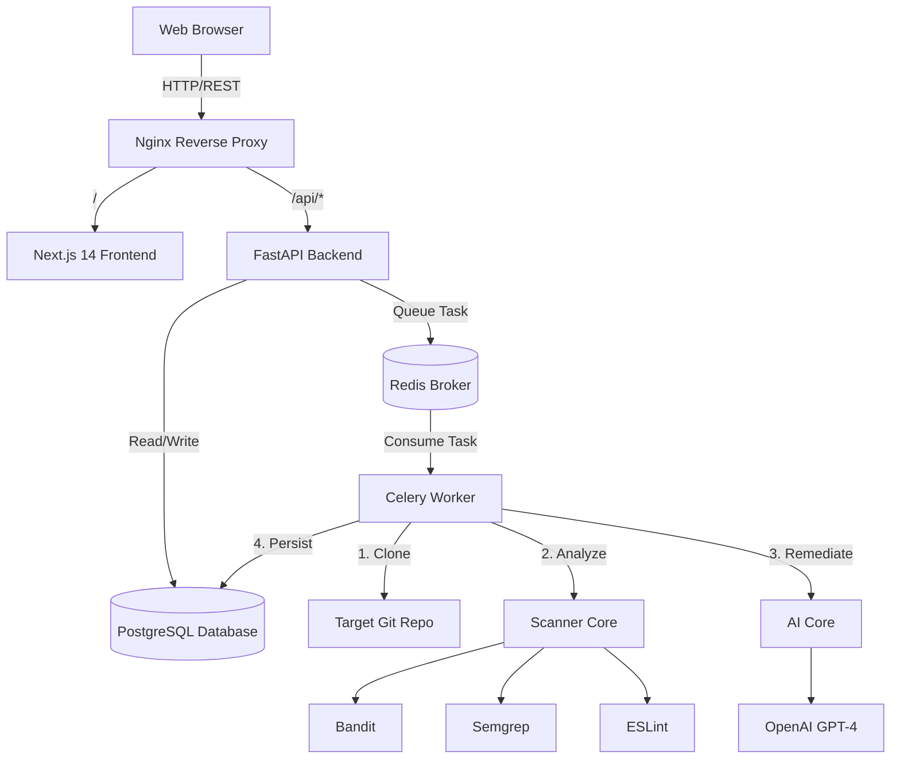

<div align="center">
  <h1>🛡️ SentinelAI (AIpSCR)</h1>
  <p><strong>AI-Powered Security Code Review & Automated Remediation Platform</strong></p>

  [](#)
  [](#)
  [](#)
  [](#)
  [](#)
  [](#)
</div>

<br />

**SentinelAI (AIpSCR)** is a production-ready, enterprise-grade monorepo for automated security vulnerability scanning and AI-powered patching. It seamlessly orchestrates static analysis tools (Bandit, Semgrep, ESLint) across your repositories and leverages Large Language Models (like OpenAI GPT-4) to not only explain the vulnerabilities but to automatically generate functional patches.

---

## ✨ Key Features

- **🚀 Automated Multi-Engine Scanning**: Runs Bandit, Semgrep, and ESLint concurrently to catch Python and JavaScript/TypeScript vulnerabilities.
- **🧠 AI-Powered Remediation**: Automatically synthesizes vulnerability context and uses LLMs to provide actionable explanations and ready-to-merge code patches.
- **📊 Data-Dense Analytics Dashboard**: A sleek, Next.js 14 App Router dashboard featuring real-time risk gauges, severity charts, and historical scan timelines.
- **⚡ Asynchronous Processing**: Offloads heavy cloning and scanning tasks to distributed Celery workers backed by Redis, keeping the API lightning fast.
- **🔐 Secure by Design**: Built with robust JWT-based authentication, strict CORS policies, and SQLAlchemy ORM protections against SQL injection.
- **🐳 DevOps Ready**: Fully containerized with Docker and Docker Compose, load-balanced via an Nginx reverse proxy.

---

## 🏗️ System Architecture



---

## 🛠️ Technology Stack

| Category | Technologies |
|---|---|
| **Frontend** | Next.js 14 (App Router), React, TypeScript, TailwindCSS v3 |
| **Backend** | Python 3.11+, FastAPI, Pydantic, JWT Authentication |
| **Database** | PostgreSQL 16, SQLAlchemy 2.0+, Alembic Migrations |
| **Worker / Queue** | Celery, Redis 7 |
| **AI / Scanners** | OpenAI API, Bandit, Semgrep, ESLint |
| **Infrastructure** | Docker, Docker Compose, Nginx, Pytest |

---

## 📂 Monorepo Structure

```text
AIpSCR/
├── apps/
│   ├── aipcsr-web/          # Next.js 14 Frontend UI
│   ├── aipcsr-api/          # FastAPI REST Backend
│   ├── aipcsr-worker/       # Celery Async Task Workers
│   └── aipcsr-github-service/ # Webhook integrations
├── core/
│   ├── ai-core/             # OpenAI provider & prompt management
│   ├── scanner-core/        # SAST engine orchestrator
│   ├── db-core/             # SQLAlchemy sessions & migrations
│   ├── observability/       # Structured logging & metrics
│   └── policies/            # Scoring rules and YAML configs
└── infrastructure/          # Dockerfiles, Nginx conf, & CI/CD
```

---

## 🚀 Getting Started

### Prerequisites
- [Docker](https://www.docker.com/) & [Docker Compose](https://docs.docker.com/compose/)
- [Node.js 20+](https://nodejs.org/) (for local frontend development)
- [Python 3.11+](https://www.python.org/) (for local backend development)

### Quick Start (Docker)

1. **Clone the repository:**
   ```bash
   git clone https://github.com/Amrit-mishra07/AIpSCR.git
   cd AIpSCR
   ```

2. **Configure Environment Variables:**
   Copy the example config and add your OpenAI API key to enable the AI patch generation.
   ```bash
   cp .env.example .env
   # Edit .env and insert your OPENAI_API_KEY
   ```

3. **Spin up the cluster:**
   ```bash
   docker-compose up -d --build
   ```

4. **Access the application:**
   - **Dashboard**: [http://localhost](http://localhost)
   - **API Docs (Swagger UI)**: [http://localhost/api/docs](http://localhost/api/docs)
   - **API Health**: [http://localhost/api/health](http://localhost/api/health)

*(Note: The database tables will be automatically initialized upon the first boot of the API container.)*

---

## 📖 Usage

1. **Register an Account**: Navigate to `http://localhost` and click "Create account".
2. **Start a Scan**: From the dashboard, click **"New Scan"**.
3. **Analyze a Repository**: Enter a public GitHub URL (e.g., `https://github.com/google/guava`).
4. **View Results**: The Celery worker will asynchronously clone, scan, and run AI remediation. The dashboard will automatically update with real-time progress and generate an actionable security report.

---

## 💻 Local Development

### Frontend
```bash
cd apps/aipcsr-web
npm install
npm run dev
```

### Backend API
Ensure `db` and `redis` containers are running first.
```bash
cd apps/aipcsr-api
pip install -r requirements.txt
uvicorn app.main:app --reload --port 8000
```

### Async Worker
```bash
cd apps/aipcsr-worker
pip install -r requirements.txt
celery -A celery_app worker --loglevel=info -c 4
```

---

## 🧪 Testing

The API uses `pytest` for comprehensive endpoint and unit testing. Test coverage includes authentication, JWT validation, health checks, and scan/report routers.

```bash
cd apps/aipcsr-api
pytest -v
```
*Current Coverage: 28/28 tests passing.*

---

## 🤝 Contributing

We welcome contributions from the community!
1. Fork the project.
2. Create your feature branch (`git checkout -b feature/AmazingFeature`).
3. Commit your changes (`git commit -m 'feat: Add some AmazingFeature'`).
4. Push to the branch (`git push origin feature/AmazingFeature`).
5. Open a Pull Request.

---

## 📜 License

Distributed under the MIT License. See `LICENSE` for more information.

<div align="center">
  <i>Built with ❤️ by the SentinelAI Team</i>
</div>
